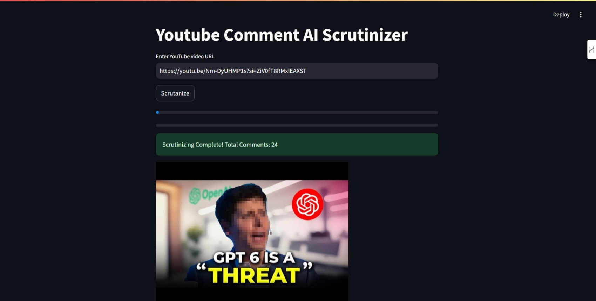
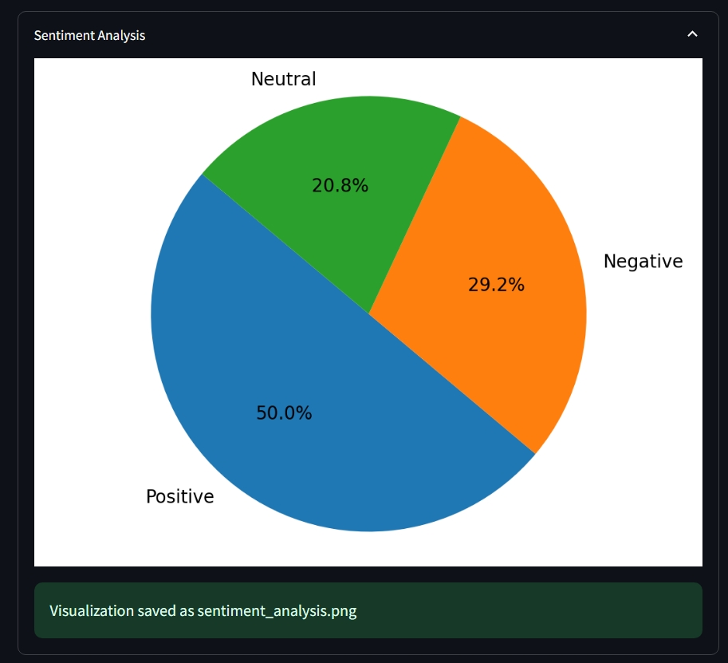
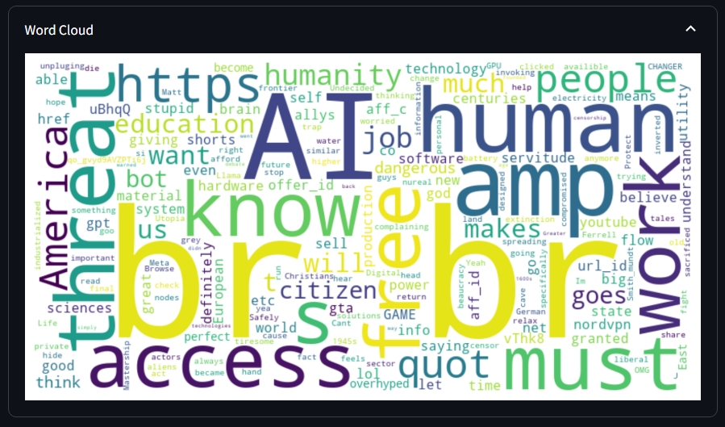
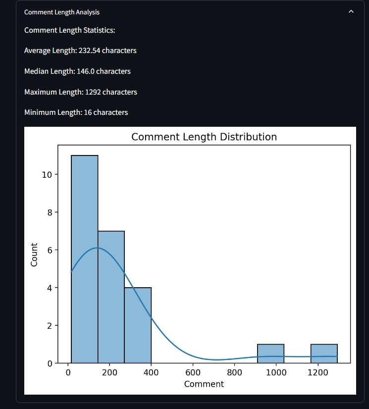
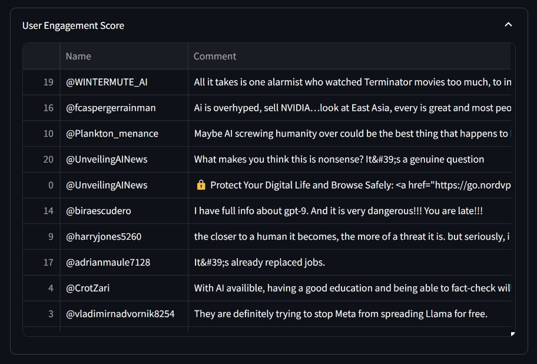
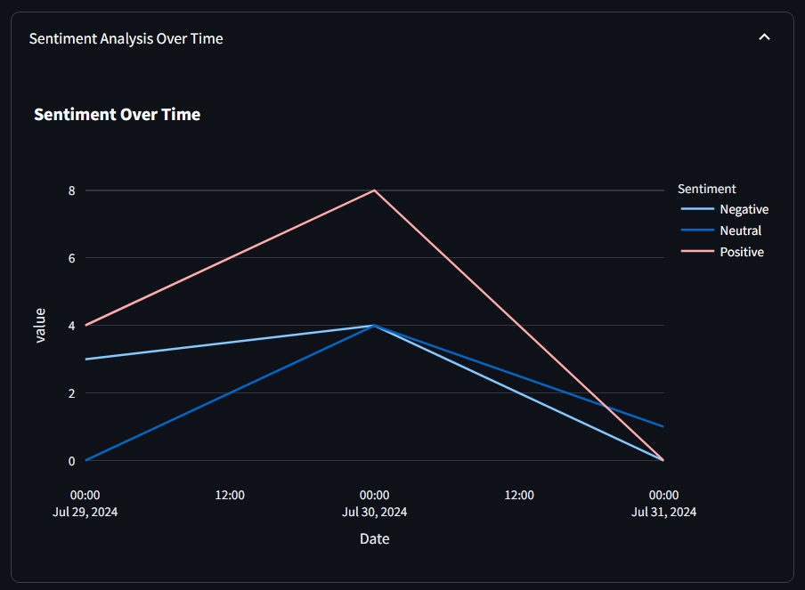
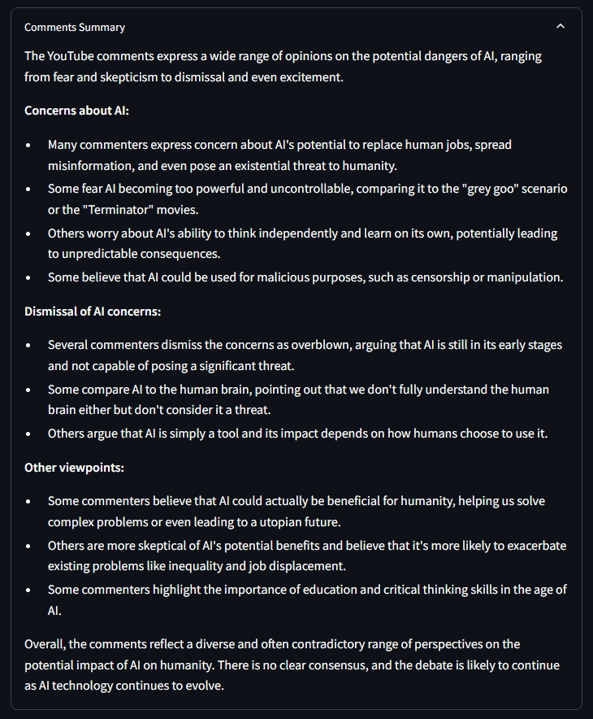
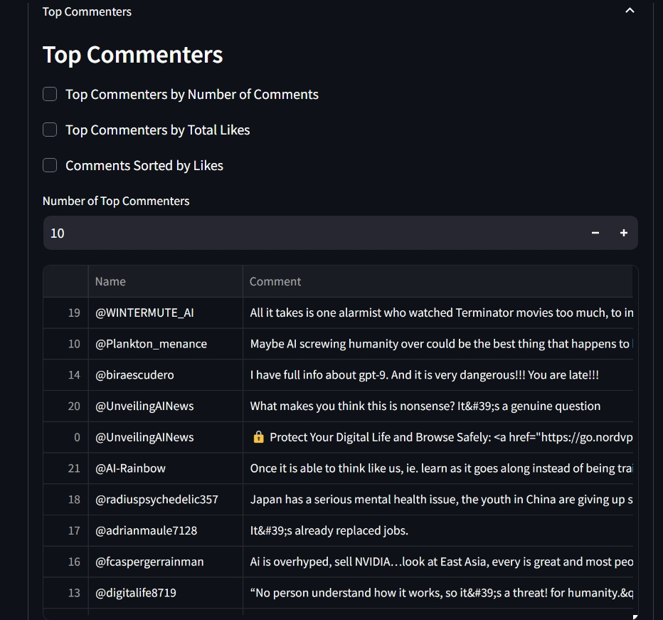
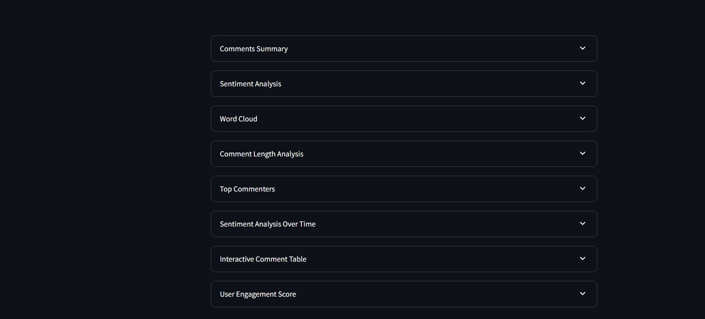

# YouTube Comment AI Scrutinizer

This Streamlit app leverages the power of Google's Gemini AI Flash model to analyze YouTube comments and provide insightful data visualizations.

## [**Check Out The Demo Here**](https://youtube-comment-ai-scrutinizer.streamlit.app/)

<table>
  <tr>
    <td></td>
    <td></td>
    <td></td>
  </tr>
  <tr>
    <td></td>
    <td></td>
    <td></td
  </tr>
  <tr>
    <td></td>
    <td></td>
    <td></td>

  </tr>
</table>

## Features

- **Scrape YouTube Comments:** Extract comments from any YouTube video URL.
- **Sentiment Analysis:** Analyze the sentiment of comments (Positive, Negative, Neutral).
- **Word Cloud:** Visualize the most frequent words in the comments.
- **Comment Length Analysis:** Analyze the distribution of comment lengths.
- **Top Commenters:** Identify the users with the most comments or likes.
- **Sentiment Analysis Over Time:** Track sentiment trends over time.
- **Interactive Data Table:** Explore the comments in an interactive table.
- **User Engagement Score:** Calculate a score based on likes, replies, and sentiment.
- **Comment Summary:** Summarize the comments using Gemini AI.
- **Trending Videos:** Explore trending videos and analyze their comments.

## Requirements

- Python 3.7+
- Streamlit
- pandas
- matplotlib
- seaborn
- textblob
- wordcloud
- plotly
- st_aggrid
- google-api-python-client
- google-generativeai

## Installation

1. Install the required packages:
   ```bash
   pip install -r requirements.txt
   ```

2. Create a `secrets.toml` file in the `.streamlit` directory and add your API keys:
   ```toml
   [general]
   GEMINI_API_KEY = "YOUR_GEMINI_API_KEY"
   YOUTUBE_API_KEY = "YOUR_YOUTUBE_API_KEY"
   ```

   **Note:** You can obtain a Gemini API key from [https://generativeai.google.com/](https://generativeai.google.com/) and a YouTube API key from [https://console.developers.google.com/](https://console.developers.google.com/).

## Usage

1. Run the app:
   ```bash
   streamlit run app.py
   ```

2. Enter a YouTube video URL in the text input field.
3. Click the "Scrutanize" button to scrape and analyze the comments.

## Contributing

Contributions are welcome! Please open an issue or submit a pull request.

## License

This project is licensed under the MIT License - see the [LICENSE.md](LICENSE.md) file for details.

## Acknowledgements

- Google Gemini AI
- YouTube Data API
- Streamlit
- st_aggrid

## Disclaimer

This app is for educational and research purposes only. It is not intended for commercial use or to violate any terms of service. Please use this app responsibly and ethically.
